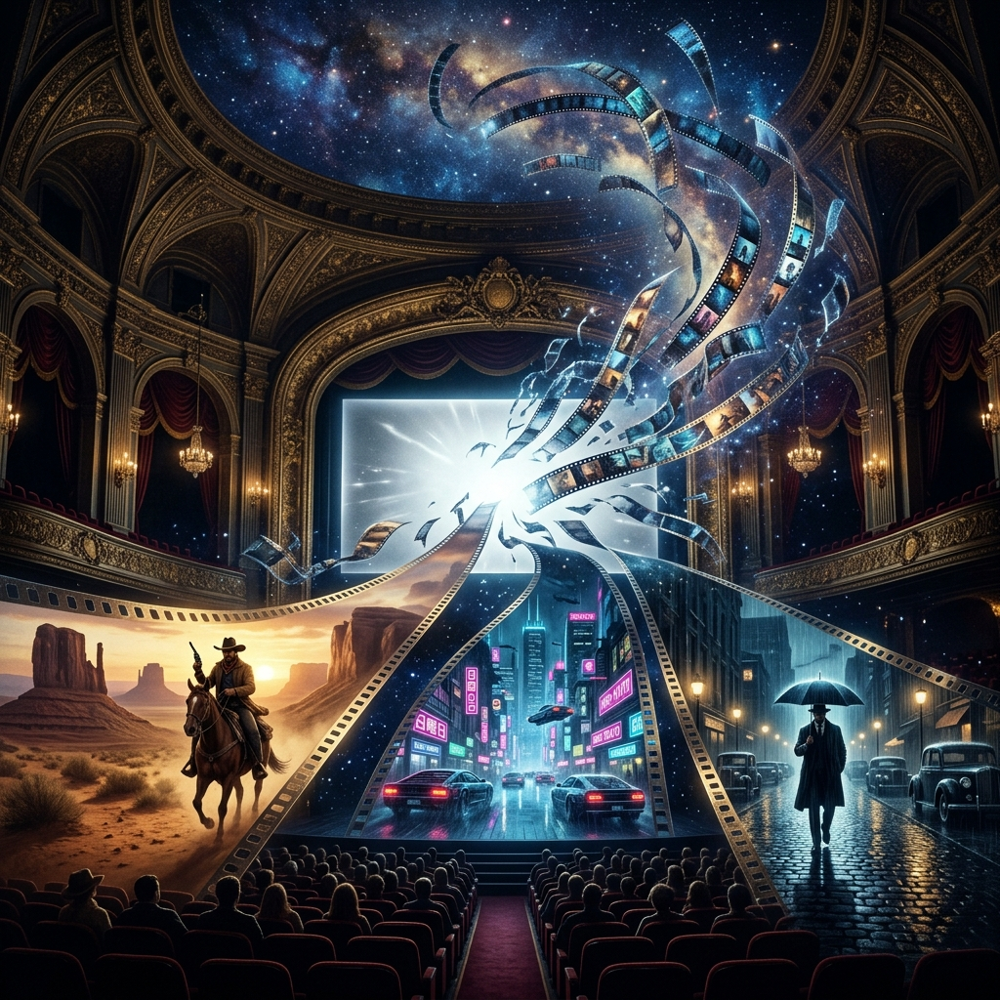

<div align="center">


<br>

# 🎬 Evrensel Sinema Arşivi
### *Dijital Bir Seyyahın Gözünden Dünya Sineması ve Görsel Mühendislik Külliyatı*

[](https://github.com/arch-yunus/Evrensel-Sinema-Arsivi)
[](https://github.com/arch-yunus/Evrensel-Sinema-Arsivi)
[](https://github.com/arch-yunus/Evrensel-Sinema-Arsivi)
[](LICENSE)

*Dünya sinemasının kültleşmiş, kurgusal, psikolojik ve görsel sınırları koparan, zamanın felsefesine meydan okuyan devasa başyapıtlarının mercek altına alındığı; analitik, katı formatlara sahip olan tamamen açık kaynaklı Türkçe sinema belleği.*

---
</div>

## 🌌 Manifestomuz: Neden Bu Külliyat?

Sinema, yönetmenlerin elinde saniyede 24 kez yalan söyleyen büyüleyici bir illüzyon makinesi veya salt vakit öldürmek için tüketilen yüzeysel bir eğlence endüstrisi değildir. İyi bir film; insan varoluşunun ve psikolojisinin (**The Human Spec**), sosyolojik kırılmaların ve ontolojik bunalımların gümüş ekrana kanlı ve dürüst yansımasıdır. Aynı zamanda kusursuz bir "görsel mühendislik harikası" ve insanlığın dijitalleşen evrendeki silinmez toplumsal hafıza kaydıdır. 

**Evrensel Sinema Arşivi**, sinema tarihine oylum oylum işlenmiş anıtsal eserleri **"tersine mühendislik" (reverse engineering)** vizyonuyla, bir saat ustası gibi atomlarına ayırmak amacıyla inşa edilmiştir. Bu depo; içi boş gişe hasılatlarına, yüzeysel popülist puanlamalara (IMDb veya Rotten Tomatoes gibi salt rakam odaklı metrikler) veya Vikipedi derinliğindeki kalıplaşmış film özetlerine odaklanmayı **kesinlikle reddeder.** 

Bunun yerine; saklı kalmış felsefi alt metinleri, kurgunun izleyiciyi vuran kognitif (bilişsel) ritmini, görüntü yönetmeninin renk paletiyle oluşturduğu travmatik atmosferleri ve yönetmenin keskin bir zekayla kurduğu o muazzam görsel mimariyi, tamamen akademik, soğukkanlı ve dokümenter bir disiplinle kayda almayı hedefler.

## 🏗️ Mimari Yaklaşım ve Katı Analiz Standartları

Bu depo, kişisel "film izleme günlüklerini" veya subjektif sığ hisleri barındıran bir blog değildir. Arşive dahil edilen her bir klasör ve içerisindeki her bir dosya, devasa yapımızın çekirdeğini oluşturan modüler ve katı bir Markdown şablonu (`SABLON.md`) kural setine göre yürütülür. Amacımız; analistlere, tutkulu sinefillere ve dijital araştırmacılara **standartlaştırılmış, pürüzsüz ve teknik bir okuma/tüketim deneyimi (UX)** sunmaktır.

Bu nedenle, her analiz filmin derisinin en altına nüfuz edebilmek için spesifik olarak şu 5 yüksek kalibreli modül üzerinden geçirilir:

- **🎬 Görsel Mühendislik ve Uzamsal Mimarlık:** Kamera açıları, Pan'lar, Tracking shot'lar, kadrajlama tercihleri, fokal kırılmalar, alan derinliği manipülasyonu. Klostrofobik daraltmaların veya epik, agorafobik devasa sekansların teknik anatomisi.
- **🎨 Renk Bilimi ve Işık Dokusu (Color Grading):** Sahnede baskın olan renk paletinin, karakterlerin zihinsel haritasını, sahne temposunu ve öykünün gizli tonunu izleyicinin bilinçaltına nasıl sızarak manipüle ettiği.
- **🧠 Psikolojik, Sosyolojik ve Felsefi Alt Metin:** Karakterlerin yüzeysel hedefleri arkasında yatan gizli ontolojik krizler, varoluşsal sancılar (Nihilizm, Absürdizm), ve evrensel insani krizlerin (id, ego, süperego çekişmeleri) incelenmesi.
- **🎼 İşitsel Biyom ve Kognitif Ses Tasarımı:** Filmin görünmeyen karakteri olarak "Ses". Foley sanatının gerilim yaratmadaki etkisi, ölümcül sessizliklerin bir silah gibi kullanılması, ambiyans yönetimleri ve usta bestecilerin seyirci üzerindeki nörolojik dominasyonu.
- **⏱️ Kurgusal Ritim (Montaj Estetiği):** Kesmelerin sekansı, sahnelerin birbirine olan ironik veya nedensel bağı ve izleyicinin zaman algısıyla oynanan (Flashback, Flashforward, Non-linear anlatı) montaj teknikleri.

## 🎞️ Çekirdek Külliyattan Öne Çıkanlar (Masterpieces)

Arşive dahil edilen ve analizi devam eden onlarca yapımdan bazıları, sinema tarihinin gidişatını tek başına değiştiren devasa kilometre taşlarıdır. İşte inceleme bekleyen o elit devlerden birkaçı:

- 🌌 **2001: A Space Odyssey (1968):** Kubrick'in; insanlığın evrimine, yapay zekanın ontolojik sessizliğine ve evrenin acımasız soğukluğuna kamerasını çevirdiği, uzun kurgu sekanslarıyla sinemayı görsel bir senfoniye çeviren başyapıt.
- ☢️ **Stalker (1979):** Tarkovsky'nin; inancı, çaresizliği ve insanın en karanlık/bencil içgüdüsel arzularını test ettiği, şiirsel sinemanın zirve noktası olan o mistik "Bölge" (Zone) tasviri.
- 🕴️ **The Godfather (1972):** Coppola'nın Amerikan rüyasını, aileyi ve şiddetin doğasını bir mafya hanedanlığı üzerinden okuduğu, güç yozlaşmasının kusursuz tasvir edildiği sinematik opera.
- 👁️ **City of God (2002):** Sokrakların çiğ, belgeselvari anlatımını kinektik kurguyla birleştirerek Rio de Janeiro favelalarındaki suç döngüsünü ritmik bir başyapıta dönüştüren Brezilya şaheseri.
- 🤠 **The Good, the Bad and the Ugly (1966):** Sergio Leone'nin, Ennio Morricone'nin kusursuz besteleriyle kurguyu dans ettirdiği, Western türünü ikonize ederek görsel mühendisliği devasa arenalara taşıdığı o kanlı destan.
- ⚔️ **Seven Samurai (1954):** Kurosawa'nın dinamik aksiyon geometrisini ve karakter inşasını yağmur altındaki savaş sekanslarıyla harmanladığı, modern sinemaya tek başına yön veren o Asya destanı.
- 🚁 **Apocalypse Now (1979):** Savaşın fiziksel yıkımından ziyade, otoriteden koparak insan zihninin mutlak deliliğe sürüklendiği o kâbusvari ve travmatik nehir yolculuğu.
- 🎭 **Persona (1966):** Ingmar Bergman'ın, insan psişesini ve maskelerini (Persona) iki kadının zihinsel çatışması üzerinden paramparça ettiği, kimlik kavramını dekonstrükte eden klostrofobik labirent.
- 🌿 **Pan's Labyrinth (2006):** Del Toro'nun, faşizmin ve savaşın yarattığı gerçeklik travmasını mitolojik, kanlı ve gotik bir fantezi dünyasıyla ustaca sentezlediği karanlık peri masalı.
- 🔥 **Grave of the Fireflies (1988):** Savaşın, çaresizliğin ve militarizmin en masum ama en travmatik yüzünü "animasyon" sınırlarının ötesine taşıyarak izleyicisini duygusal bir infaza uğratan Takahata klasiği.

## 📂 Depo Hiyerarşisi ve Epistemolojik Ontolojisi

Arşivimiz, filmlerin dramatik dokularına, tematik izlerine ve tarihsel kütüphane janrlarına göre kelimenin tam anlamıyla "evrensel" bir ontolojiye oturtularak tasnif edilmiştir. Sürekli genişlemeye, iteratif güncellemeler almaya ve yatay/dikey formellikte büyümeye son derece müsait olan bu makro mimari ağaç, an itibariyle aşağıdaki devasa arterler üzerinden gelişimini sürdürmektedir:

```text
📦 Evrensel-Sinema-Arsivi
 ┣ 📂 Animasyon-ve-Cizgi-Sinema
 ┃ ┣ 📜 Grave-of-the-Fireflies-1988.md                    — Savaşın en travmatik ve masum hali.
 ┃ ┣ 📜 Spider-Man-Into-the-Spider-Verse-2018.md          — Kare hızı manipülasyonu ve görsel devrim.
 ┃ ┣ 📜 The-Lion-King-1994.md                             — Shakespearevari ihanet ve varoluş döngüsü.
 ┃ ┗ 📜 Toy-Story-1995.md                                 — Antropomorfik objelerin 3D boyuttaki ilk ayak izi.
 ┣ 📂 Asya-Sinemasi
 ┃ ┣ 📜 Chungking-Express-1994.md                         — Şehir yalnızlığının kinetik ve neon melankolisi.
 ┃ ┣ 📜 In-the-Mood-for-Love-2000.md                      — Aşkın ve hüznün kusursuz görsel koreografisi.
 ┃ ┣ 📜 Oldboy-2003.md                                    — İntikamın, vahşetin ve ensestin kanlı şiiri.
 ┃ ┣ 📜 Parasite-2019.md                                  — Sınıfsal anatominin mimari üzerinden kusursuz inşası.
 ┃ ┣ 📜 Seven-Samurai-1954.md                             — Kurosawa'nın epik aksiyon geometrisi.
 ┃ ┗ 📜 Spirited-Away-2001.md                             — Ruhlar aleminin büyüleyici animistik ekosistemi.
 ┣ 📂 Avrupa-Sinemasi
 ┃ ┣ 📜 Amelie-2001.md                                    — Paris'in absürd, tatlı ve yeşil-kırmızı simetrisi.
 ┃ ┣ 📜 Cinema-Paradiso-1988.md                           — Sinema makinesinin romantize edilmiş nostaljisi.
 ┃ ┣ 📜 Life-is-Beautiful-1997.md                         — Trajedinin mizahla maskelenmiş acımasız absürdlüğü.
 ┃ ┗ 📜 The-400-Blows-1959.md                             — Fransız Yeni Dalgasının isyankar kamerasızlığı.
 ┣ 📂 Bilim-Kurgu-ve-Distopya
 ┃ ┣ 📜 2001-A-Space-Odyssey-1968.md                      — Evrimin, monolitin ve karanlık uzayın ürkütücü senfonisi.
 ┃ ┣ 📜 A-Clockwork-Orange-1971.md                        — Otoritenin ve şiddetin Beethoven eşliğinde distopik dansı.
 ┃ ┣ 📜 Blade-Runner-1982.md                              — Cyberpunk neonlarının altındaki sentetik varoluş krizi.
 ┃ ┣ 📜 Interstellar-2014.md                              — Relativitenin ve astrofiziğin duygusal yerçekimi.
 ┃ ┣ 📜 Mad-Max-Fury-Road-2015.md                         — Kıyamet sonrası çölün kinetik enerji patlaması.
 ┃ ┣ 📜 The-Matrix-1999.md                                — Platon'un mağara alegorisinin siberpunk simülasyonu.
 ┃ ┗ 📜 The-Truman-Show-1998.md                           — Medyanın gözetim toplumu ve sahte tanrıcılık eleştirisi.
 ┣ 📂 Dram-ve-Suc
 ┃ ┣ 📜 12-Angry-Men-1957.md                              — Tek odada geçen klostrofobik bir Amerikan adelet şüpheciliği.
 ┃ ┣ 📜 City-of-God-2002.md                               — Favela sokaklarının çiğ, belgeselvari suç frekansı.
 ┃ ┣ 📜 Forrest-Gump-1994.md                              — Amerikan tarihinin bir otistiğin gözünden sürreal geçişi.
 ┃ ┣ 📜 Goodfellas-1990.md                                — Mafya mitinin Scorsese kurgusuyla sarsılmaz çöküşü.
 ┃ ┣ 📜 Pulp-Fiction-1994.md                              — Popüler kültürün non-linear Tarantino kıyma makinesi.
 ┃ ┣ 📜 Scarface-1983.md                                  — Kapitalizmin ve hırsın neon-kan banyosunda boğuluşu.
 ┃ ┣ 📜 The-Departed-2006.md                              — Köstebeklerin Boston sokaklarındaki paranoyak satranç oyunu.
 ┃ ┣ 📜 The-Godfather-1972.md                             — Gücün, ailenin ve yozlaşmanın kusursuz Amerikan operası.
 ┃ ┗ 📜 The-Shawshank-Redemption-1994.md                  — Umudun ve zamanın gri taş duvarlar arasındaki zaferi.
 ┣ 📂 Fantastik-ve-Macera
 ┃ ┣ 📜 Pans-Labyrinth-2006.md                            — Faşizmin karanlık masallarla organik ve kanlı savaşı.
 ┃ ┣ 📜 The-Lord-of-the-Rings-The-Fellowship-of-the-Ring-2001.md — Devasa epik fantezinin dünyevi temellerinin atılışı.
 ┃ ┣ 📜 The-Lord-of-the-Rings-The-Return-of-the-King-2003.md     — Mitolojik savaşın ve görsel mimarinin kesin zaferi.
 ┃ ┗ 📜 The-Lord-of-the-Rings-The-Two-Towers-2002.md             — CGI ve kurgu devriminin Helm's Deep ile şahlanışı.
 ┣ 📂 Korku-ve-Paranormal
 ┃ ┣ 📜 Alien-1979.md                                     — Uzayın karanlığında endüstriyel ve klostrofobik bir izolasyon.
 ┃ ┣ 📜 Psycho-1960.md                                    — Duş sahnesiyle sinematografik cinayet devriminin miladı.
 ┃ ┣ 📜 The-Exorcist-1973.md                              — İnancın karanlık varlıklarla yaşadığı sinir bozucu imtihan.
 ┃ ┗ 📜 The-Shining-1980.md                               — Simetrinin ve yalıtımın insanı delirten Kubrick geometrisi.
 ┣ 📂 Psikolojik-Gerilim-ve-Gizem
 ┃ ┣ 📜 Fight-Club-1999.md                                — Tüketim toplumunun nihilist ve şizofrenik bir altkültür isyanı.
 ┃ ┣ 📜 Memento-2000.md                                   — Hafızanın parçalanan zamansal kurgusu ve geriye doğru akışı.
 ┃ ┣ 📜 Se7en-1995.md                                     — Yedi ölümcül günahın kapkaranlık, umutsuz ve pislik dolu şehri.
 ┃ ┣ 📜 Shutter-Island-2010.md                            — Deliliğin ve travmanın gotik bir adada kurduğu zihinsel hapishane.
 ┃ ┣ 📜 Taxi-Driver-1976.md                               — Şehir yabancılaşmasının ve uykusuzluğun kanlı patlaması.
 ┃ ┗ 📜 The-Silence-of-the-Lambs-1991.md                  — İki zekanın kalın camlar arkasındaki manipülatif psikolojik satrancı.
 ┣ 📂 Romantik-ve-Melodram
 ┃ ┣ 📜 Before-Sunrise-1995.md                            — Diyalogların akıcılığıyla 24 saatlik geçici bir rüya boyutu.
 ┃ ┣ 📜 Casablanca-1942.md                                — İkinci Dünya Savaşı'nın dumanlı, fedakar ve klasik romantizmi.
 ┃ ┣ 📜 Eternal-Sunshine-of-the-Spotless-Mind-2004.md     — Hafızanın silik koridorlarında acının ve melankolinin inşası.
 ┃ ┗ 📜 Her-2013.md                                       — Kodlanmış bir işletim sistemine duyulan yalnız metropolis aşkı.
 ┣ 📂 Sanat-ve-Bagimsiz-Sinema
 ┃ ┣ 📜 Mulholland-Drive-2001.md                          — Hollywood rüyasının paramparça olmuş şizofrenik Lynch kabusu.
 ┃ ┣ 📜 Persona-1966.md                                   — İki ruhun, iki bedenin sessizlikle ve yüzlerle eridiği ontolojik buhran.
 ┃ ┣ 📜 Requiem-for-a-Dream-2000.md                       — Bağımlılığın acımasız temposuyla parçalanan bir "Hızlı Çekim" cehennemi.
 ┃ ┣ 📜 Stalker-1979.md                                   — Görünmeyen inancın, post-apokaliptik bir kurguda felsefi arayışı.
 ┃ ┗ 📜 Trainspotting-1996.md                             — Eroin alt kültürünün çamurlu, kinetik ve dumanlı isyanı.
 ┣ 📂 Savas-ve-Antimilitarizm
 ┃ ┣ 📜 Apocalypse-Now-1979.md                            — Vietnam ormanlarının derinliklerinde mutlak deliliğin Coppola tablosu.
 ┃ ┣ 📜 Come-and-See-1985.md                              — İkinci Dünya Savaşı cehenneminin sağır edici ve travmatik realizmi.
 ┃ ┣ 📜 Full-Metal-Jacket-1987.md                         — Militarizmin robotlaştırdığı insan zihninin iki perdeli ölüm gösterisi.
 ┃ ┗ 📜 Saving-Private-Ryan-1998.md                       — Omaha Plajı'ndaki desatüre edilmiş, çiğ ve kan dondurucu kaos sarmalı.
 ┣ 📂 Tarihi-ve-Epik
 ┃ ┣ 📜 Schindlers-List-1993.md                           — Siyah-beyaz soykırım cehenneminde Kırmızı Paltolu kızın masumiyeti.
 ┃ ┗ 📜 The-Pianist-2002.md                               — Yıkıntıların arasında sanata ve hayata tutunan yalnız bir melodi.
 ┣ 📂 Western-ve-Eski-Bati
 ┃ ┣ 📜 Django-Unchained-2012.md                          — Tarantino'nun kan sıçratan, intikam dolu kölelik dekonstrüksiyonu.
 ┃ ┣ 📜 Once-Upon-a-Time-in-the-West-1968.md              — Leone kamerasının uzun bakışmaları ve tren yollarının ölümü getirişi.
 ┃ ┣ 📜 The-Good-the-Bad-and-the-Ugly-1966.md             — Spagetti Western'in üç köşeli, destansı müzikal zirvesi.
 ┃ ┗ 📜 Unforgiven-1992.md                                — Şiddetin kahramanlık mitini yıkan ve mitosları deviren soğuk finali.
 ┣ 📜 CONTRIBUTING.md (Kolektif Katkı Protokolü)
 ┣ 📜 LICENSE (MIT)
 ┗ 📜 SABLON.md (Standart İnceleme Modülü)
```

## 🗺️ Stratejik Gelişim Matrisi ve Büyüme Vektörü (Yol Haritası)

Bu bilgi arşivi tek seferlik kodu yazılıp kenara bırakılmış statik bir mazi dosyası değildir; tam aksine sürekli yaşayan, veritabanını agresif şekilde genişleten ve evrilen **organik bir ekosistemdir.** Sistem, aşağıdaki algoritmik fazlar doğrultusunda derinlik kazanmaya ve "Evrensel" sıfatının altını doldurmaya durmaksızın devam edecektir:

- [x] **Faz 1 - Çekirdek Altyapı Düğümünün İnşası:** Ana repo mimarisinin kurulması, Katkı Rehberlerinin (`CONTRIBUTING.md`), açık kaynak lisans konfigürasyonunun (MIT) ve zorunlu inceleme şablonlarının (`SABLON.md`) sisteme entegre edilmesi. Devasa klasör ağacının tarihin gölgesinde kalmış ve popüler sinemaya kafa tutmuş yüzlerce çıplak başyapıtla (Movie Stubs) taslak halinde indekslenmesi.
- [ ] **Faz 2 - Analitik Dergi Ciltlerinin Dokunması (Deep Dive):** Başlıkları oluşturulmuş ve depoda iskelet olarak yatan devasa filmlerin her birinin, şablondaki o katı ve entelektüel kurallara uygun olarak, ağır bir iskelet işçiliğiyle satır satır doldurulması ve Markdown dosyalarının saf film bilgeliğiyle zenginleştirilmesi.
- [ ] **Faz 3 - Auteur İndeksleri ve Yönetmen Biyomları:** Sinemaya devrim getirmiş yönetmenlerin (Örn: *Nolan'ın Zaman Döngüleri*, *Tarantino'nun Kan ve Diyalog Senfonisi*, *Tarkovsky'nin Şiirsel Melankolisi*, *Hitchcock'un Kamera Matematiği*) kendilerine has özel indeks dosyalarıyla, filmleri arasında bir bağlam ağı oluşturularak arşive makro seviyede dahil edilmesi.
- [ ] **Faz 4 - UI / Web Mimarisine Çıkış:** Saf Markdown (MD) uzantılı metin terminallerinden oluşan bu salt veri külliyatının; Docusaurus, Next.js, Obsidian Publish veya farklı bir Statik Site Üretici (SSG) gücüyle birleşip grafik tasarımı ve okuma tipografisi ultra-premium seviyede olan, devasa, aranabilir bir Web Kütüphanesi arayüzüne (Web App) dönüştürülmesi.
- [ ] **Faz 5 - Küresel Açık Kaynak Topluluğu İle Asimilasyon:** İnternetteki bağımsız sinefillerin, yönetmen adaylarının ve veri analistlerinin `Pull Request (PR)` mekanizması üzerinden arşive kolektif fikir fırtınalarıyla dahil olması. Türk sineması, Kuzey Avrupa veya İran sineması gibi spesifik kolların da bizzat komünite tarafından buraya beslenmesiyle manifestonun kelimenin tam anlamıyla "Evrenselleşmesi".

## 🛡️ Akademik Disiplin ve İntihal (Kaos) Politikası

Arşiv, kesinlikle bağımsız düşünceyi ve eleştirtici özgün analizi merkeze alır.
Başka sinema sitelerinden çekilen yapay copy-paste metinler, salt olay örgüsünü (plot) anlatan ve spoiler veren ruhsuz film özetleri veya ChatGPT gibi yapay zekaların üreteceği "genel geçer, heyecansız plastik yığınlar" çekirdek kodumuza aykırıdır ve sisteme entegre **edilmeyecektir.** 
Havuza düşecek her inceleme, kendi cüretkar fikrini beyan etmeli, ama bunu yaparken sinematografik terimleri kılıç gibi kullanmalıdır (`Mise-en-scène`, `Jump Cut`, `Dutch Angle`, `Gaze`, `Leitmotif`).

## 🤝 Kolektif Katkı Protokolü (Open-Source Collaboration)

Evrensel Sinema Arşivi kapalı bir zindan değil; yeteneğine, kalemine ve görsel zekasına inanan herkesin (open-source contributor) kod bloklarına katkı sunabileceği dinamik, otonom ve elit bir karargâhtır. Yaratılan bu soğukkanlı mimariyi ve analitik eleştiri standartlarını benimsediğiniz takdirde, deponun evrensel veri setine siz de devasa bir sarsıntı bırakabilirsiniz.

Küresel arşive eklenmesini hayati bir gereklilik olarak gördüğünüz kült yapımlar için, ya da kişisel olarak hazırladığınız, filmle bağdaşan entelektüel incelemelerinizi repoya pushlamak adına lütfen [Katkıda Bulunma Güvenlik Çerçevesini (CONTRIBUTING.md)](CONTRIBUTING.md) dikkatle tarayınız. Oradaki katı standartlar dahilinde projemize hemen bir **Pull Request (PR)** açabilir ya da mimari/felsefi herhangi bir beyanatta bulunmak adına GitHub'da bir **Issue** yaratıp tartışma başlatabilirsiniz.

---

<p align="center">
  <br>
  <i>"Sinema, hayatın sıkıcılığının acımasızca kesilip atılmış konsantre bir halidir."</i><br>
  <b>— Alfred Hitchcock</b>
  <br><br>
  <i>"Eğer sadece insanların ne görmek istediğini onlara verirseniz... Ortaya çıkacak olan şey sinema değil, köleliktir."</i><br>
  <b>— Andrei Tarkovsky</b>
  <br>
</p>
